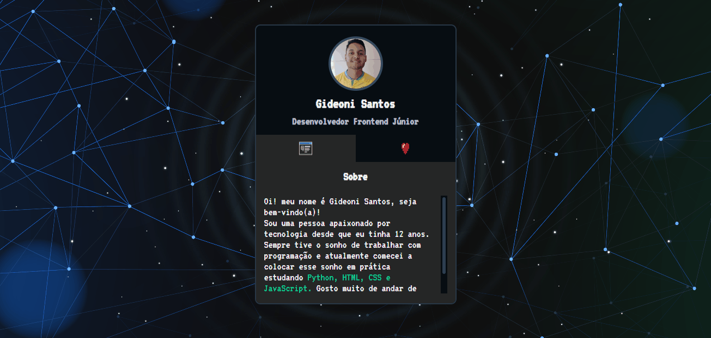

# Projeto Mini Portifolio

Um Projeto realizado na MapaDevWeek. Foi meu primeiro contato com a programação, aprendi a criar estrutura com o HTML, estilizar usando o CSS e fazer as interações das abas com JavaScript. 

